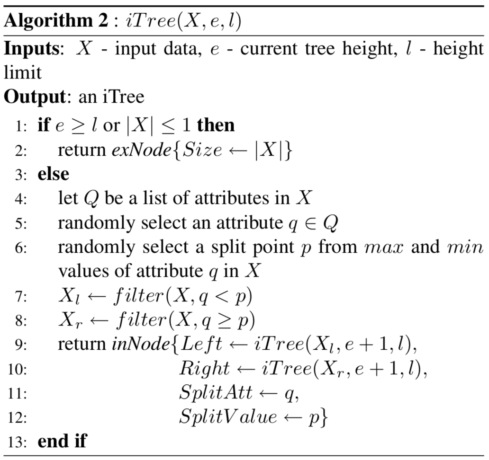

# Isolation Forest Implementation
The goal of this project is to implement the original [Isolation Forest](https://cs.nju.edu.cn/zhouzh/zhouzh.files/publication/icdm08b.pdf) algorithm by Fei Tony Liu, Kai Ming Ting, and Zhi-Hua Zhou.      

**Methodology**     
- For a given dataset, we build a random tree on them by splitting at random variables and values. Anomalies are isolated closer to the root of the tree; whereas normal points are isolated at the deeper end of the tree. And if we have a forest of isolation trees, you can average the height of each instance to make your algorithm more robust. 

**Key Ideas of the Algorithm**       
 - Most existing model-based approaches to anomaly detection construct a profile of *normal instances*, then identify instances that do not conform to the normal profile as anomalies.      
 - Anomalies are ‘few and different’, which make them more susceptible to isolation than normal points.        
 - If you have a binary tree, anomalies are easy to be separated by choosing random features and using uniform random cut. Anomalies are isolated closer to the root of the tree; whereas normal points are isolated at the deeper end of the tree.     
 

**Characteristics**    
- Randomly select samples. So the algorithm doesn’t have to walk through all the normal points. Thus more efficient than the existing models that need to build the profiles of normal points first.      
- If data size is large, the trees will grow wider and deeper, the anomalies will not be that distinct from normal points anymore.      

## Data sets

For this project, we'll use three data sets:

* [Kaggle credit card fraud competition data set](https://www.kaggle.com/mlg-ulb/creditcardfraud)    

* Get cancer data into `cancer.csv` by executing [savecancer.csv](https://github.com/parrt/msds689/blob/master/projects/iforest/savecancer.py)     

* [http.zip](https://github.com/parrt/msds689/blob/master/projects/iforest/http.zip)       

## Visualization of normal versus anomaly separation    

<table border="0">
<tr><td>http.csv, 200 trees, 99% desired TPR</td></tr>
<tr>
<td border=0>

</tr>
</table>

<table border="0">
<tr><td>creditcard.csv, 200 trees, 80% desired TPR</td><td>creditcard.csv, 200 trees, 90% desired TPR</td></tr>
<tr>
<td border=0>

<td border=0>

</tr>
</table>

<table border="0">
<tr><td> cancer, 300 trees, 70% desired TPR</td><td> cancer, 300 trees, 80% desired TPR</td></tr>
<tr>
<td border=0>

<td border=0>

</tr>
</table>

## Algorithm

extracted from the Liu *et al* paper:

<table border="0">
<tr>
<td width="50%" valign="top"></td><td width="50%" valign="top"></td>
</tr>
<tr>
<td valign="top">

</td>
<td valign="top">
Please use this version of average path length <tt>c()</tt>, not the one in the original paper: 

Then finally here's the scoring formula: 

where "<i>H(i)</i> is the harmonic number and it can be estimated by <i>ln(i)</i> + 0.5772156649 (Euler’s constant)."
</td>
</tr>
</table>

## Requirement    
- numpy  
- pandas   
- sklearn   

## Usage    
run the `score.py` file with `-noise` and `-improved`     

## Credits      
- [msds689-iforest](https://github.com/weiweisf/msds689/tree/master/projects/iforest). Thanks to Terence for introducing such a great algorithm and providing the great materials.      
